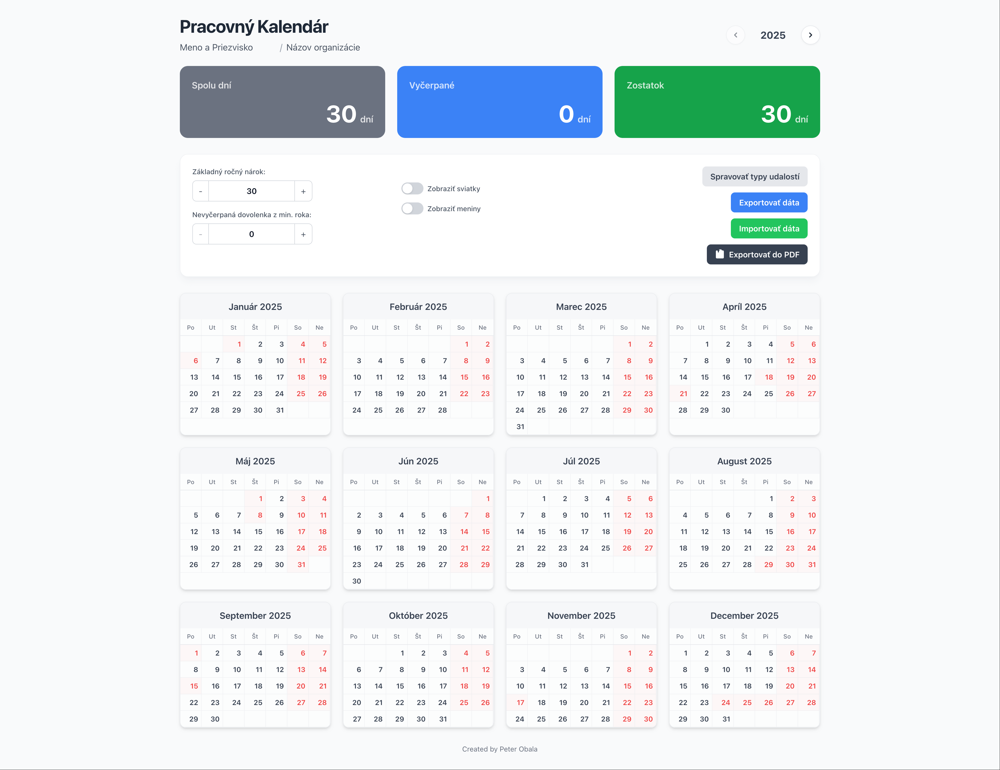
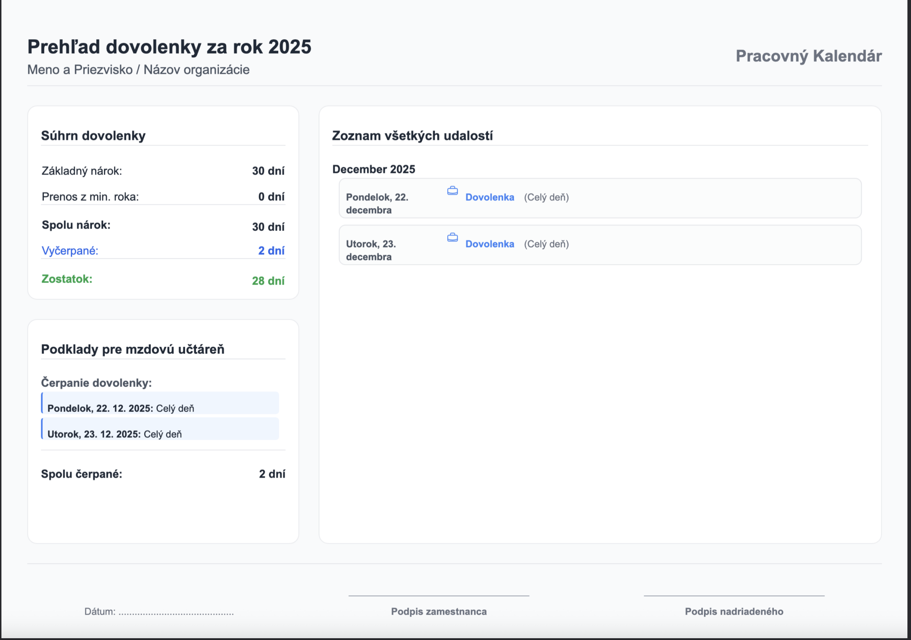
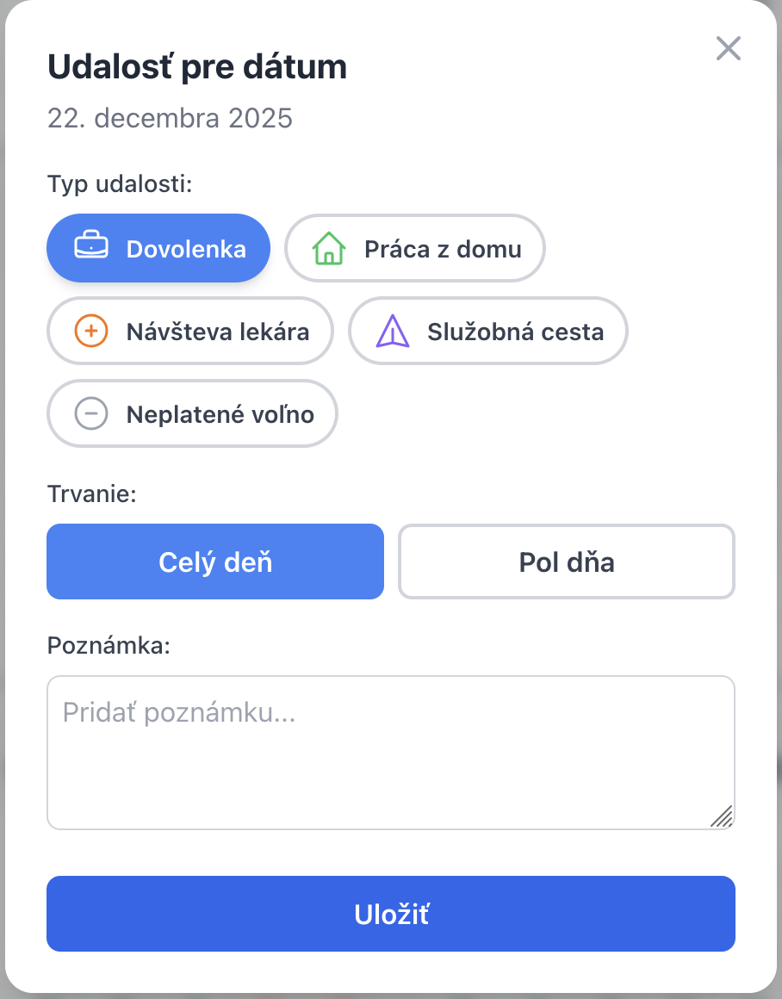

# 🗓️ Slovak Work Calendar

A modern, frontend-only work calendar and attendance planner built with **React** & **TypeScript**.  
This interactive application allows users to track vacation days, sick leave, home office, and other custom events.  
It features a clean, Apple-inspired UI, professional PDF exports for payroll, and full data persistence in the browser's local storage.

---

## 🌟 Screenshots

### 🧭 Main Dashboard  

### 📄 PDF Export Report  

### 🗓️ Custom Event Modal  

---

## 🚀 Key Features

- **Interactive Yearly Calendar:** View the entire year at a glance (2025–2030).
- **Custom Event Types:** Track not just vacation, but also home office, doctor's visits, and business trips.  
  Users can create, edit, and delete their own event types with custom names, colors, and icons.
- **Vacation Tracking:** Manage your annual vacation allowance, including carry-over days from the previous year.  
  The app automatically calculates used and remaining days.
- **Half-Day Support:** Log events for full or half days with precise tracking.
- **Slovak Localization:** Includes built-in support for Slovak public holidays and name days, which can be toggled on or off.
- **Professional PDF Export:** Generate a clean, detailed attendance report perfect for payroll or HR.
- **Data Persistence:** All data (name, organization, events, settings) is saved locally in your browser.
- **Import/Export Data:** Easily back up your data to a JSON file or transfer it to another device.
- **Fully Frontend:** No backend or database required. The application runs entirely in the browser.

---

## 🧰 Tech Stack

- **Framework:** React 19  
- **Language:** TypeScript  
- **Styling:** Tailwind CSS (via CDN)  
- **PDF Generation:** jsPDF & html2canvas  
- **Build Tool:** Vite  

---

## 🛠️ Getting Started

Follow these instructions to get a copy of the project up and running on your local machine.

### Prerequisites

You need to have [Node.js](https://nodejs.org/) (which includes npm) installed.

---

### Installation & Running

1. **Clone the repository:**

    git clone https://github.com/peterfromslovakia/slovak-work-calendar.git  
    cd slovak-work-calendar

2. **Install dependencies:**

    npm install

3. **Run the development server:**

    npm run dev

   By default, the app will start on http://localhost:3000 or 5173.

4. **Build for production:**

    npm run build

5. **Preview the production build:**

    npx serve dist

   The optimized files will be located in the `dist` directory.

